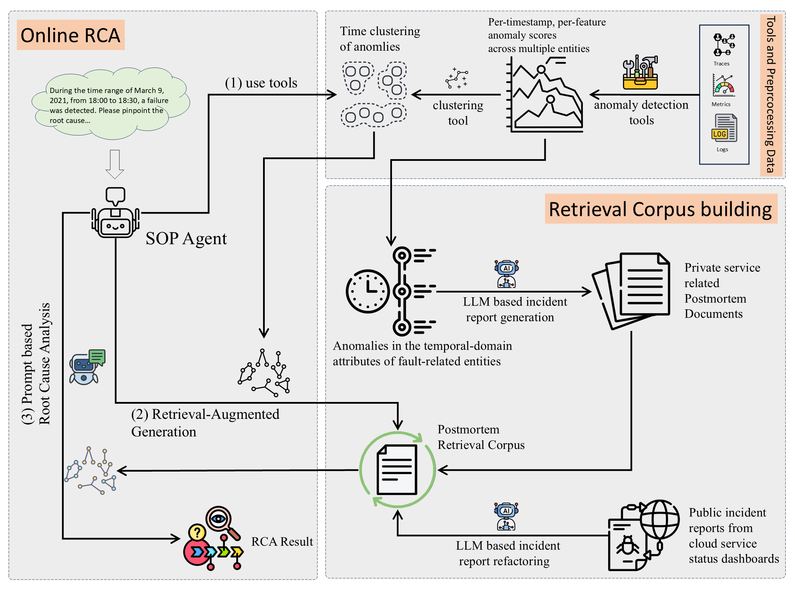

# TRAC-RCA

&ensp;
[](https://opensource.org/licenses/MIT)&ensp;


</div>

TRAC-RCA is a tool-augmented framework for microservice RCA via temporal anomaly clustering and RAG. The RAG corpora comprise an open and a private corpus. The text chunks for the open corpus are derived from public incident tickets of multiple cloud service status dashboards, and those for the private corpus are based on multimodal anomaly data from the downtime of a private microservices system with missing incident reports. When TRAC-RCA meets a failure RCA query, it first uses anomaly detection tools to collect per-timestamp, per-feature anomaly scores across multiple entities, and employs clustering tools to obtain multiple anomaly clusters in the query time window. For each cluster, TRAC-RCA leverages a RAG system to augment the prompt with relevant historical postmortems. This process facilitates an LLM-enhanced RCA, after which all cluster outcomes are ranked to identify the final root cause.



## 1.Quick Start

> ⚠️ We use the **OpenRCA** dataset and supplementary baseline **RCA-agent** (https://github.com/microsoft/OpenRCA) to evaluate TRAC-RCA. Note: since the OpenRCA dataset includes a large amount of telemetry and RCA-agent requires extensive memory operations, we recommend using a device with at least 80GB of storage space and 32GB of memory.

## 2.Installation

TRAC-RCA requires **Python >= 3.10**. It can be installed by running the following command:

```bash
# [optional to create conda environment]
# conda create -n openrca python=3.10
# conda activate openrca

# clone the repository
git clone https://github.com/grampus-whcz/TRAC-RCA.git
cd TRAC-RCA
# install the requirements
pip install -r requirements.txt
```

The telemetry data can be download from [Google Drive](https://drive.google.com/drive/folders/1wGiEnu4OkWrjPxfx5ZTROnU37-5UDoPM?usp=drive_link). Once you have download the telemetry dataset, please put them into the path `dataset/` (which is empty now).

The directory structure of the data is:

```
.
├── {SYSTEM}
│   ├── query.csv
│   ├── record.csv
│   └── telemetry
│       ├── {DATE}
│       │   ├── log
│       │   ├── metric
│       │   └── trace
│       └── ...
└── ...
```

where the `{SYSTEM}` can be `Telecom`, `Bank`, or `Market`, and the `{DATE}` format is `{YYYY_MM_DD}`.

We employ **OmniTransfer** for Multivariate Time Series Anomaly Detection to derive anomaly information for multiple entities and features within the target time domain.
We made certain changes to enable it to handle OpenRCA data.

```bash

git clone https://github.com/grampus-whcz/OmniTransfer.git
cd OmniTransfer
# following the readme.md to install
pip install -r requirements.txt
```

Note: path used in ClusTopoRCA with OmniTransfer needs to be reconfigured.

## 3.Reproduction

To reproduce results in the paper, please first setup your API configurations before running OpenRCA's baselines. Taking OpenAI as an example, you can configure `rca/api_config.yaml` file as follows:

```yaml
SOURCE: "AI"
MODEL: "gpt-4o"
API_KEY: "sk-xxxxxxxxxxxxxx"
```

Then, run the following commands for result reproduction:

```bash
python -m rca.run_agent_standard_multi_candidate --dataset Bank --controller_max_step 1  --start_idx 0  --end_idx 135

python -m rca.run_agent_standard_multi_candidate --dataset Telecom --controller_max_step 1  --start_idx 0  --end_idx 50

python -m rca.run_agent_standard_multi_candidate --dataset Market/cloudbed-1 --controller_max_step 1  --start_idx 0  --end_idx 69

python -m rca.run_agent_standard_multi_candidate --dataset Market/cloudbed-2 --controller_max_step 1  --start_idx 0  --end_idx 77
```

The generated results and monitor files can be found in a new `test` directory created after running any test script.

You can also generate log file like those in experiments folder, and use two scripts (5.extract_all_key_info.py and 8.get_all_result_from_tasks_info_all_task_type.py) to get the statistical results.

## 4.Postmortem corpora

### Processed Postmortem Data (JSON format)

The processed JSON files for both public and private postmortems have been uploaded to the /jsonl directory within the repository. Specifically:

> Public postmortems (processed by LLM) and Private postmortems (processed by LLM) are both available at: https://github.com/grampus-whcz/TRAC-RCA/tree/main/jsonl

### Faiss Indices

The knowledge base indices for the hybrid library, public library, and private library have been uploaded to the repository:

> Hybrid library index is in /faiss_index_postmortem; Public library index is in /faiss_index_postmortem_public; and Private library indexis in /faiss_index_postmortem_private.

## 5.some tips

### Method 1: Quickly load pkl

```bash
python -c "import pickle; data=pickle.load(open('index.pkl','rb')); print(f'Number of records: {len(data)}')"
```

### Method 2: Quickly load faiss index

```bash
python -c "import faiss; idx=faiss.read_index('index.faiss'); print(f'Number of records: {idx.ntotal}')"
```

## 6.copy framework

1. cp -r /root/shared-nvme/work/agent/OpenRCA XXX
2. replace "OmniTransfer*new" with a "OmniTransfer_new?", exclude files like "*.md, _.log, _.txt, \_.json, \*.ipynb"

## 7.Omnitransfer

We have released a runnable version of OmniTransfer in our environment for researchers to download and use.
The repository link is https://github.com/grampus-whcz/OmniTransfer.
